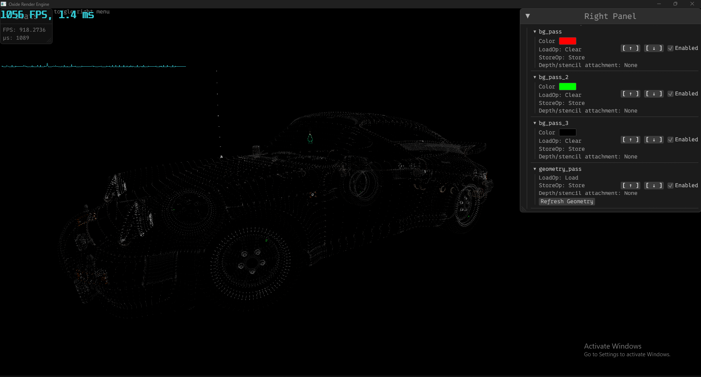
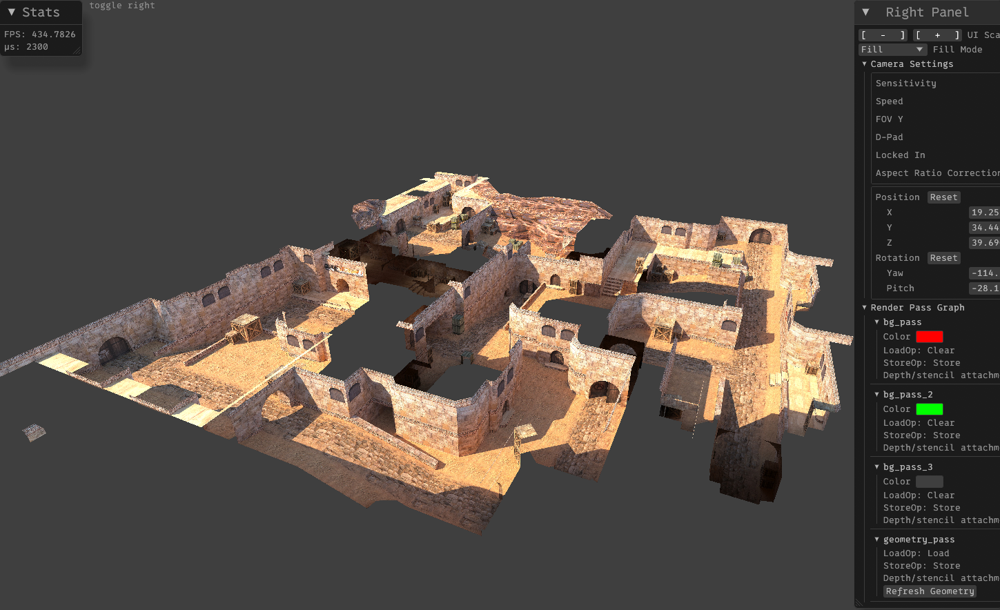

# Oxide Render Engine

Oxide is a **web-based 3D rendering engine** written in **Rust**, powered by **[WGPU](https://github.com/gfx-rs/wgpu)**
and **[WebGPU](https://www.w3.org/TR/webgpu/)**.
It’s designed as part of a Bachelor's thesis in **Computer Graphics** and focuses on providing a modern,
high-performance rendering pipeline that works natively and in the browser via **[WASM](https://webassembly.org/)**.

## Features

* Built with **Rust** and **wgpu** for cross-platform GPU rendering
* Compiles to **WebAssembly** for browser-based applications
* Integrated **winit** window handling for native builds
* Logging with `log::info!` (currently prints pressed keys to the browser console)
* Easy development workflow for both **native** and **WASM** targets

## Examples

[WASM Examples](https://safetimamovic.github.io/oxide/)

### Screenshots

```bash
cargo run --package auto --release
```




Model: _free-1975-porsche-911-930-turbo_ by **Lionsharp Studios**
[sketchfab.com](https://sketchfab.com/3d-models/free-1975-porsche-911-930-turbo-8568d9d14a994b9cae59499f0dbed21e)

```bash
cargo run --package de_dust2 --release
```



Model: _de-dust2-cs-map_ by **pancakesbassoondonut**
[sketchfab.com](https://sketchfab.com/3d-models/de-dust2-cs-map-056008d59eb849a29c0ab6884c0c3d87)

```bash
cargo run --package mc --release
```


Model: _forest-2-by-creepercoastal_ by **CreeperCoastal**
[sketchfab.com](https://sketchfab.com/3d-models/forest-2-by-creepercoastal-1435a8422df5458196ec7b36fc556248)

## 🚀 Getting Started

### **1. Clone the repository**

```bash
git clone https://github.com/SafetImamovic/oxide.git
cd oxide
```

### **2. Run natively**

Enable info-level logging and run:

```bash
RUST_LOG=info cargo run --package auto --release
```

This launches the `Auto` example in a native window using `winit`.

### **3. Build for WebAssembly**

To build the examples into a `doc/` directory run:

```bash
./wasm_build.sh
```

This builds the `wasm` binaries, copies the `.glb` resources directory and builds `index.html`-s per example.

When targeting browsers, randomness support must be configured explicitly for `getrandom`.
Use the following command to build:

```bash
RUSTFLAGS='--cfg getrandom_backend="wasm_js"' wasm-pack build --target web --no-default-features
```

This generates the `pkg/` folder containing the `.wasm` and JS bindings.

## Getting Started

```rust
#[oxide_main]
pub fn run() -> anyhow::Result<()>
{
    oxide::utils::bootstrap::show_start_message();

    let resources = oxide::resources::load_resources();
    log::info!("Loading Resources from: {}", resources.display());

    let mut engine = oxide::engine::EngineBuilder::new()
        .with_debug_ui()
        .with_toggle(KeyCode::Tab)?
        .build()?;

    engine.add_obj_model("auto", "free_1975_porsche_911_930_turbo.glb");

    let runner = oxide::engine::EngineRunner::new(engine)?;

    runner.run()?;

    oxide::utils::exit::show_exit_message();

    Ok(())
}

```

## License

MIT

### **4. Serve locally with Python**

To bypass CORS restrictions when testing in the browser:

```bash
python -m http.server 8080
```

Then open [http://localhost:8080/docs/](http://localhost:8080/docs/) in your browser.

## 🔮 Roadmap

* [x] Basic 3D rendering pipeline
* [x] Camera controls and transformations
* [x] Render pass graph management
* [x] Asset loading (models, textures via `gltf`)
* [x] WebGPU shader management
* [ ] Lighting
